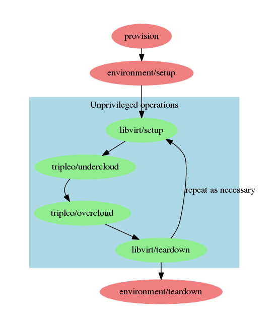

## Overview

## Provision

:exclamation: This role requires privileged access to the target host.

- Creates Ansible inventory entry for the target host, and generates an
  inventory file.
- Creates a non-root user on the target host that will be used in
  subsequent connections.
- Arranges for the non-root user to have `sudo` privileges.

This step can be skipped if you can already log into your target host
as a non-root user with `sudo` privileges and you are comfortable
creating your own Ansible inventory files.

## Environment/install

:exclamation: This role requires privileged access to the target host.

Ensures that target host has required packages, network configuration,
and user accounts to run the quickstart:

- Installs and starts libvirtd if necessary
- Creates libvirt networks
- Configures KVM
- Whitelists libvirt bridges in `/etc/qemu/bridges.conf` so they can
  be used by an unprivileged user.

This role only needs to be run once on your target host (unless you
run the `environment/cleanup` role).

## Libvirt/setup

:green_heart: This role can run exclusively as an unprivileged user.

This role creates the virtual infrastructure onto which we will deploy
the undercloud and overcloud:

- Create the overcloud hosts
- Create the undercloud host
- Boot the undercloud
- Add undercloud to Ansible inventory
- Arrange for ssh access to the undercloud host

## Tripleo/undercloud

:green_heart: This role can run exclusively as an unprivileged user.
Installs the undercloud.

## Tripleo/overcloud

:green_heart: This role can run exclusively as an unprivileged user.

Installs and validates the overcloud.

## Libvirt/teardown

:green_heart: This role can run exclusively as an unprivileged user.

Removes the undercloud and overcloud virtual hosts and their
associated storage from the remote libvirt environment.

## Environment/cleanup

:exclamation: This role requires privileged access to the target host.

Reverses most of the changes made by the `environment/install` role.

- Destroy libvirt networks created by tripleo-quickstart and removes
  associated configuration from the qemu bridge helper
